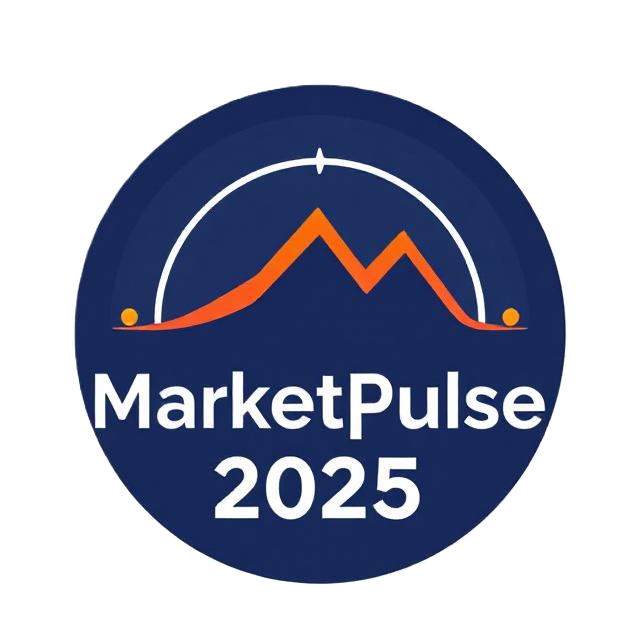

# MarketPulse 2025 📊



## 📊 Overview

A modern, AI-powered market research dashboard providing real-time insights into industry trends, customer segments, and strategic opportunities. MarketPulse 2025 delivers comprehensive analysis and actionable recommendations through an intuitive, mobile-optimized interface.

[](https://github.com/Rudraa01)
[]()

## 🚀 Features

### Interactive Dashboard
- **Real-time Visualizations**: Dynamic charts and graphs powered by Chart.js
- **Responsive Design**: Optimized for desktop, tablet, and mobile devices
- **Export Functionality**: Print-friendly dashboard with professional styling
- **Interactive Elements**: Hover effects, clickable components, and smooth animations

### Comprehensive Analysis
- **Industry Trends**: AI-driven personalization, customer retention focus, spatial computing, M&A acceleration
- **Customer Segmentation**: Digital-first professionals, environmental conscious consumers, AI-enhanced users
- **Competitive Landscape**: SWOT analysis, Porter's Five Forces, Growth-Share Matrix
- **Market Opportunities**: Impact vs. feasibility assessment with strategic prioritization
- **Performance Benchmarks**: Industry KPIs and performance indicators

### Strategic Recommendations
- Six prioritized recommendations with implementation timelines
- Risk assessment and mitigation strategies
- Resource requirements and success metrics
- Detailed implementation roadmap

## 📁 File Structure

```
marketpulse-2025/
├── index.html                    # Main dashboard interface
├── dashboard.css                 # Professional styling and responsive design
├── dashboard.js                  # Interactive visualizations and functionality
├── logo.svg                     # MarketPulse brand logo
├── market_data.json             # Structured market research data
├── strategic_analysis_report.md  # Comprehensive strategic analysis
├── implementation_guide.md       # Step-by-step implementation guide
├── todo.md                      # Project completion tracking
└── README.md                    # Project documentation
```

## 🛠️ Technologies Used

- **HTML5**: Semantic structure and accessibility
- **CSS3**: Modern styling with gradients, animations, and responsive design
- **JavaScript (ES6+)**: Interactive functionality and data visualization
- **Chart.js**: Professional charts and graphs
- **Font Awesome 6.0**: Modern icons and visual elements
- **SVG Animation**: Custom animated logo and visual elements
- **Mobile-First Design**: Touch-optimized interface with responsive navigation
- **Performance Optimization**: Lazy loading and content visibility features

## 📈 Key Insights

### Market Trends 2025
- **Global Growth**: 3.3% projected growth with Asia Pacific leading
- **AI Adoption**: Companies with AI-specific models show 2x performance advantage
- **Digital-First**: 72% of professionals identify as digital-first consumers
- **Environmental Focus**: 66% of consumers influenced by brand environmental stance

### Customer Segments
1. **Digital-First Professionals** (72% penetration)
2. **Environmental Conscious Consumers** (66% penetration)
3. **AI-Enhanced Users** (45% penetration)
4. **Retention-Focused Customers** (58% penetration)

### Strategic Priorities
1. **AI-Driven Personalization** (Critical Priority)
2. **Customer Retention Focus** (Critical Priority)
3. **Spatial Computing Investment** (High Priority)
4. **Environmental Value Proposition** (High Priority)
5. **Digital-First Service Enhancement** (Medium Priority)
6. **Holistic Market Intelligence** (Medium Priority)

## 🎯 Usage Instructions

### Viewing the Dashboard
1. Open `index.html` in a modern web browser
2. Navigate through different sections using the dashboard layout
3. Interact with charts and visualizations for detailed insights
4. Use the export button for print-friendly version

### Understanding the Data
- Review `market_data.json` for raw data and sources
- Read `strategic_analysis_report.md` for detailed analysis
- Follow `implementation_guide.md` for action steps

### Customization
- Modify `dashboard.css` for styling changes
- Update `dashboard.js` for functionality enhancements
- Edit `market_data.json` to reflect your specific market data

## 📊 Dashboard Sections

### 1. Executive Summary
High-level overview of market outlook, customer evolution, and competitive dynamics.

### 2. Industry Trends
- Market trend distribution visualization
- Key trend impact assessment
- Growth projections and market dynamics

### 3. Customer Segments
- Segment penetration analysis
- Detailed customer profiles
- Behavioral and demographic insights

### 4. Competitive Landscape
- Competitive positioning radar chart
- Analysis framework comparison
- Strategic positioning assessment

### 5. Market Opportunities
- Opportunity matrix (impact vs. feasibility)
- Investment priorities
- Market size and potential analysis

### 6. Performance Benchmarks
- Industry performance trends
- Key performance indicators
- Benchmark comparisons

### 7. Strategic Recommendations
- Prioritized action items
- Implementation timelines
- Expected outcomes and ROI

## 🔧 Technical Requirements

### Browser Compatibility
- Chrome 80+
- Firefox 75+
- Safari 13+
- Edge 80+

### Dependencies
- Chart.js (CDN)
- Font Awesome (CDN)
- Modern browser with JavaScript enabled

### Performance
- Optimized for fast loading
- Responsive design for all screen sizes
- Print-friendly styling

## 📋 Implementation Roadmap

### Phase 1: Immediate Actions (0-6 months)
- AI-driven personalization implementation
- Customer retention strategy shift

### Phase 2: Medium-Term Initiatives (6-18 months)
- Spatial computing investment
- Environmental value proposition development

### Phase 3: Long-Term Positioning (18+ months)
- Digital-first service enhancement
- Holistic market intelligence implementation

## 📊 Key Performance Indicators

### Customer Engagement
- Customer lifetime value improvement: 25-40%
- Retention rate enhancement
- Personalization effectiveness scores
- Digital channel adoption rates

### Competitive Position
- Market share growth in key segments
- AI capability maturity assessment
- Environmental positioning effectiveness
- Digital-first service delivery ratings

### Innovation and Growth
- New product/service launch success rates
- Technology adoption speed
- Partnership development effectiveness
- Market opportunity capture rates

## 🎨 Design Features

### Visual Design
- Modern gradient backgrounds
- Professional color scheme
- Consistent typography
- Intuitive layout and navigation

### Interactive Elements
- Hover effects on charts and cards
- Smooth animations and transitions
- Click-to-expand functionality
- Progress bar animations

### Responsive Design
- Mobile-first approach
- Flexible grid layouts
- Scalable visualizations
- Touch-friendly interactions

## 📄 Documentation

### Strategic Analysis Report
Comprehensive 15,000+ word analysis covering:
- Market trends and dynamics
- Customer segmentation evolution
- Competitive landscape assessment
- Strategic recommendations
- Risk analysis and mitigation

### Implementation Guide
Detailed implementation instructions including:
- Phase-by-phase roadmap
- Resource requirements
- Success metrics and KPIs
- Risk management strategies

## 🔄 Updates and Maintenance

### Data Updates
- Market data should be refreshed quarterly
- Trend analysis updated semi-annually
- Competitive landscape monitored continuously

### Technical Maintenance
- Browser compatibility testing
- Performance optimization
- Security updates for dependencies

## 📞 Support and Customization

### Customization Options
- Brand-specific styling and colors
- Industry-specific data integration
- Custom chart types and visualizations
- Additional analysis frameworks

### Data Integration
- Real-time data source connections
- API integrations for live updates
- Custom data import capabilities
- Automated reporting features

## 🏆 Best Practices

### Using the Dashboard
1. Start with the Executive Summary for overview
2. Deep-dive into specific sections based on needs
3. Cross-reference insights across multiple sections
4. Use strategic recommendations for action planning

### Implementation Success
1. Follow the phased implementation approach
2. Monitor KPIs regularly
3. Adapt strategies based on market changes
4. Maintain continuous improvement mindset

## 📈 Expected Outcomes

### Short-term (0-6 months)
- Enhanced market understanding
- Improved strategic decision-making
- Better customer segmentation
- Competitive advantage identification

### Medium-term (6-18 months)
- Increased market share
- Improved customer retention
- Enhanced competitive positioning
- Technology advantage realization

### Long-term (18+ months)
- Market leadership position
- Sustainable competitive advantage
- Innovation leadership
- Customer loyalty excellence

## 🎯 Success Metrics

### Dashboard Usage
- User engagement with interactive elements
- Time spent analyzing different sections
- Export and sharing frequency
- Strategic recommendation implementation rate

### Business Impact
- Strategic decision quality improvement
- Market opportunity identification success
- Competitive advantage realization
- ROI on strategic initiatives

---

## 🔗 Connect & Contribute

- GitHub: [@Rudraa01](https://github.com/Rudraa01)
- Instagram: [@YourInstaHandle](https://instagram.com/_rudra.aaaaa)

## 📝 Project Information

**Created**: July 2025  
**Version**: 1.1  
**Last Updated**: July 12, 2025  
**Author**: Rudraa01

<div align="center">

[](https://github.com/Rudraa01)

</div>

For questions, customization requests, or technical support, please refer to the implementation guide or create an issue in the GitHub repository.
